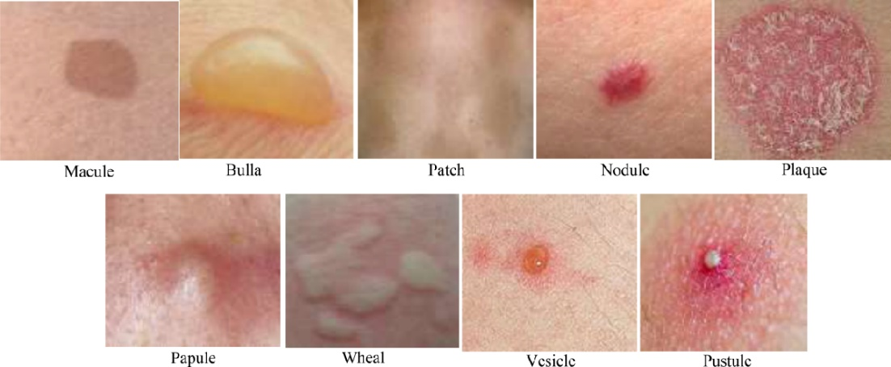

Nematoda
Friday, January 9, 2026
3:03 PM

[Nematoda_lm](https://notebooklm.google.com/notebook/9531aea0-6365-42e8-87c5-79b03983336a)  

# General Morphology & Biology
Nematodes are commonly called **roundworms** because they appear circular when viewed in cross-section. Their physical structure is defined by:
• **Size:** Ranges from a few millimeters to over 1 meter in length.
• **External Protection:** The body is covered by a tough, resistant, and non-digestible **cuticle**.
• **Sexual Dimorphism:** They have separate sexes. **Males** are generally smaller with a **curved or coiled posterior** containing **copulatory spicules** and sometimes a fan-shaped **bursa** for attachment during mating.
• **Internal Systems:**
◦ **Digestive:** A complete system including a **buccal capsule** (mouth cavity), esophagus, gut, and anus.
◦ **Reproductive:** Highly developed, tubular, and coiled organs that occupy a large portion of the body.
◦ **Fecundity:** Females can produce hundreds to millions of offspring.

# 

