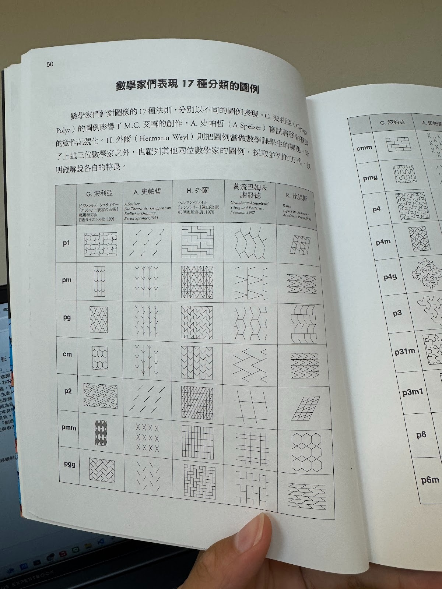

PM
- 基本移動方式：平移(p, c)、鏡射(m)、旋轉(p)、位移鏡射(g)
- “*The Grammar of Ornament*”(Jones Owen 裝飾圖案研究，地中海、中國為主) + “世界裝飾圖集成1-4”(Albert Racinet 有含到日本): 共2000個圖案。兩書皆在工業革命市場經濟交際的時代誕生，因而被定為古典圖樣。20世紀後，圖樣態多元化，難以收列分類。
- Penrose Tiling

