PM

- 情緒形成公式
  - type1: 保命的情緒: 面對劍齒虎恐懼
  - type2: **詮釋(某事件/想法)+認同+重複**
- 我不夠好
  - 事實是，你對大部分的事情其實都做得不錯，雖然缺乏經驗、興趣和天賦，都可以用來解釋為何你在一些領域未能達成自己的期望，但這于你不夠好無關。
  - 此感覺與自尊心低落有關
    - 對過去經歷的負面解讀
  - 把事件拿出來重新分析:**詮釋(某事件/想法)+認同+重複**
  - 寫勝利日誌
  - 正面日記
- 自尊六大支柱
  - 有意識的生活
  - 自我接納: 珍視尊重自己
  - 自我負責: 沒有人會來救你，只有你能改變自己的人生
  - 自信果敢: 尊重自己的渴望需求，並以適當形式表達
  - 有目標的生活: 運用能力達成目標
  - 正直並依價值觀行事(正義)
- 防衛心
  - 當強烈認同的信念受到攻擊，會出現情緒反應
- 在意別人對你的想法
  - 理解別人並不在乎你
  - 理解你並不在乎別人
  - 放下自我形象
    - 人們永遠會根據他們的價值觀與信念詮釋你的言行
- 憂鬱
  - 憂鬱時，更多的思考不是解決之道
  - 憂鬱是一個徵兆，表示你需要遠離頭腦的思想，放下對過去未來的擔憂，當前情況的詮釋，重新連結到當下
- 拖延
  - [procrastinate.pdf](../../../../resources/8f6a0d25451c4538acadf43c76459595.pdf)
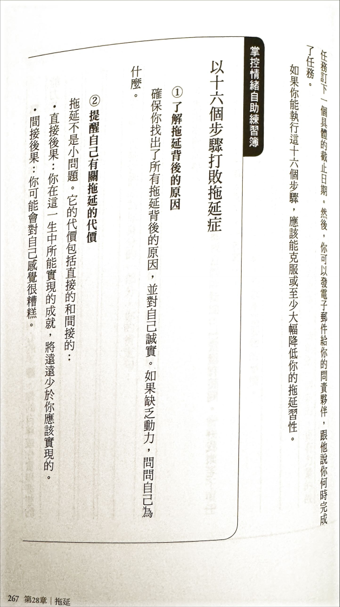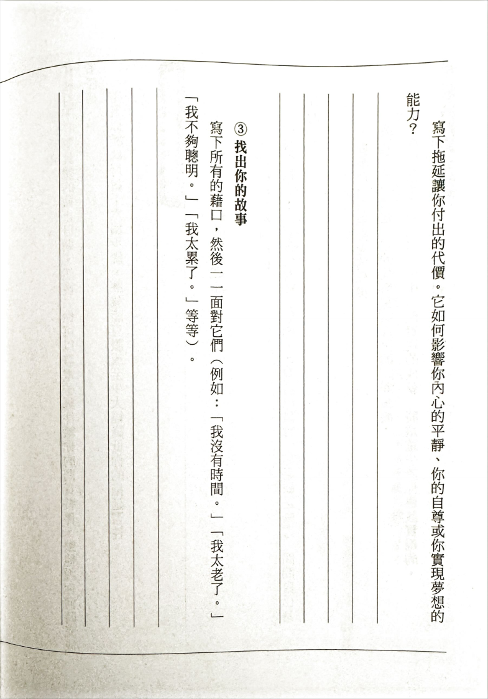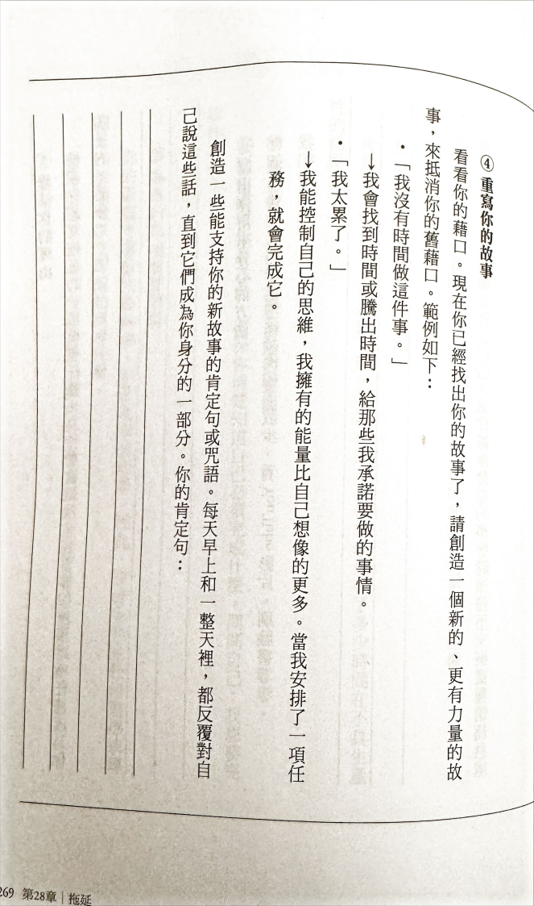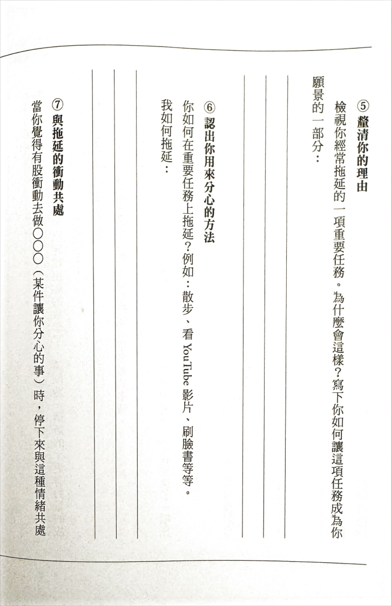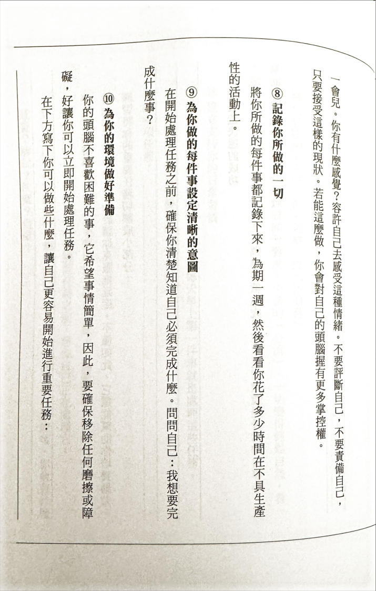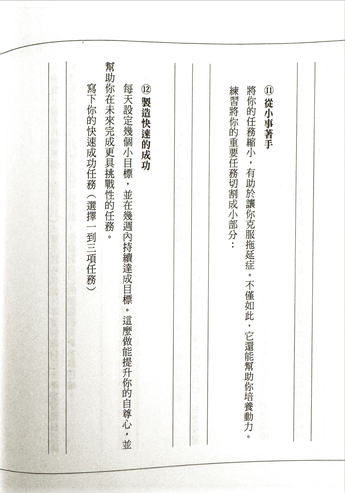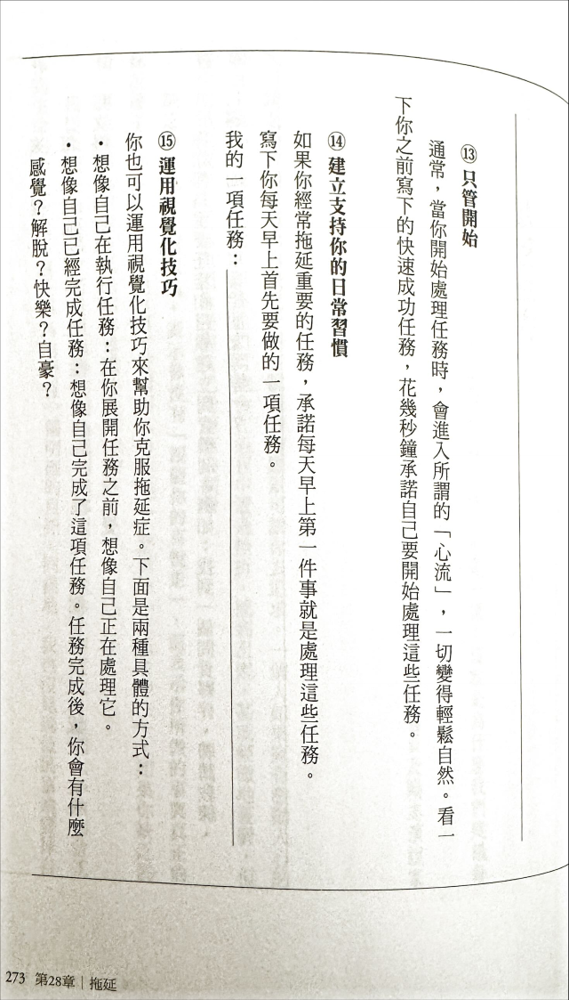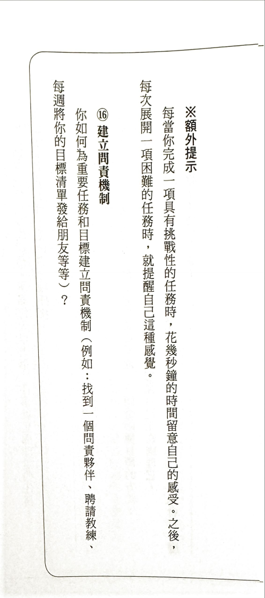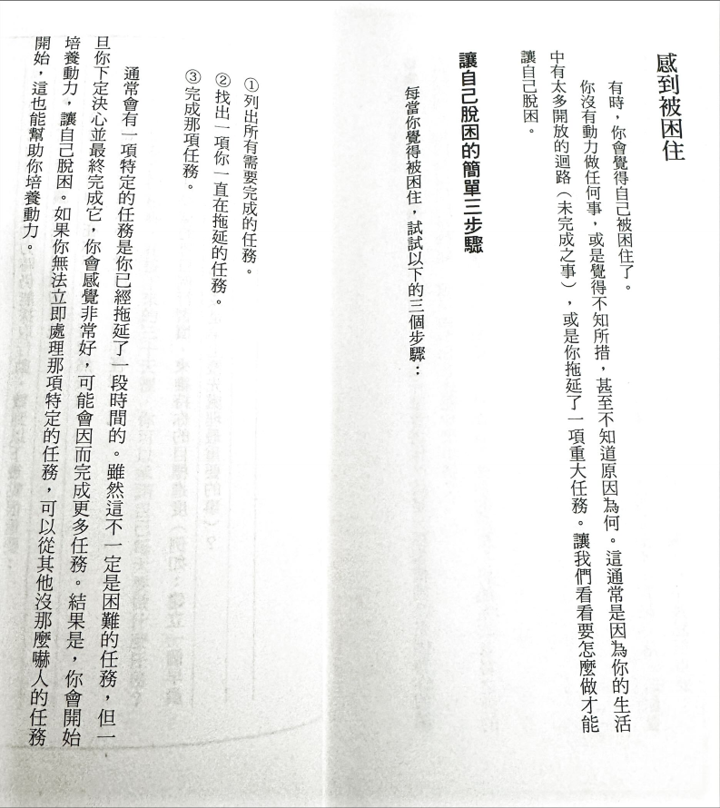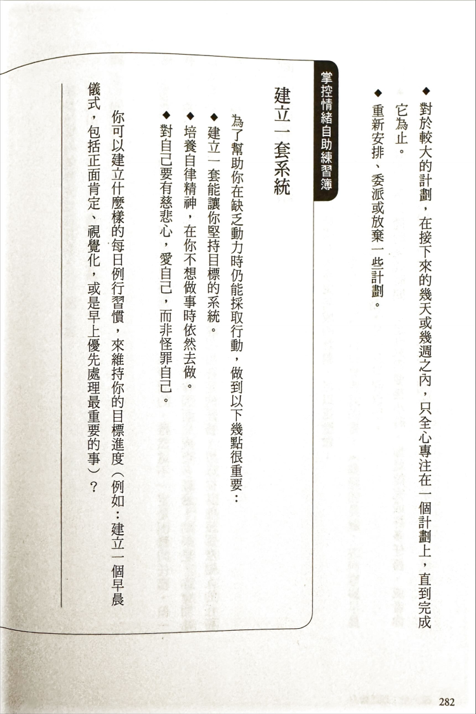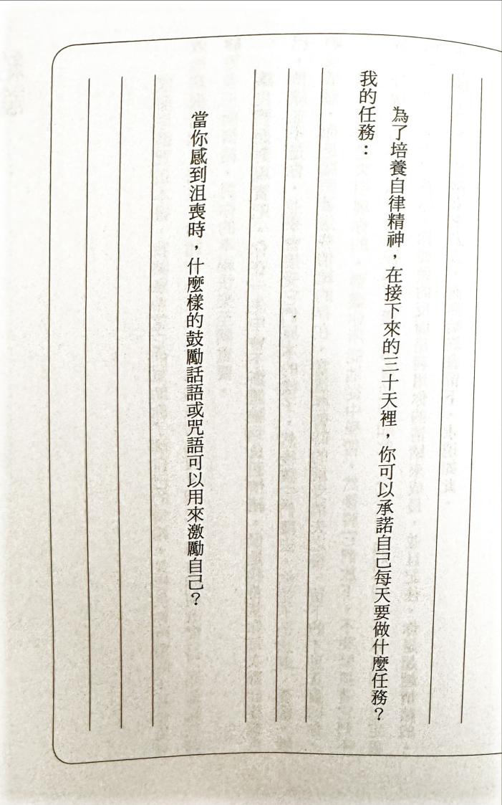
