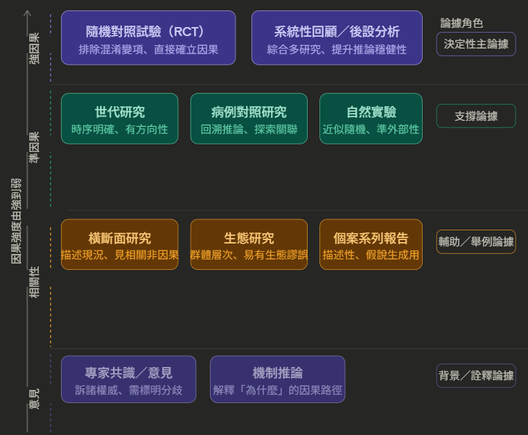

AM

- 愛就是
  - 情境、對話
  - 比喻(核心性質: 令人回味、吸引、耀眼、鑰匙)
  - 物品、產出
  - 形象化
- 美就是
  - 畫面
  - 比喻: 性質: 快樂、擴散、跳脫瑣事
  - 狀態
- 快樂就是
  - 狀態
  - 認知
**統整: 經驗敘述: 感官經驗+感受經驗+(想到其他經驗)**
**WHAT: 經驗；WHY: 價值觀一致性；HOW: 行動與槓桿**
- 描寫: 用文字重現一小段時間中的經驗
  - 
| 技巧   | 內外動     | 遠中近 | 五感     |
|--------|------------|-------------------------------------------|----------|
| 氛圍感 | 節奏(句長) | 細節留白                                  | 主觀濾鏡 |
- 核心: 從人的內心帶入
- 人物: 挑選最能反映個性、內心的外在表現描寫(可+修辭渲染)
- 景物: 精確措辭(柳條依依、花影搖曳、白雲悠悠)
  - 
| 切入點 | 定點/移動/定景換點 | 特寫、色彩點染 |
|----|----|----|
| 時令(春夏秋冬) | 分類(eg天地山川草木蟲魚鳥獸) | 情景交融、景物聯想 |
- 物體
  - 扣緊主題，迅速聯想
- 記敘: 精確地交代事件的來龍去脈
  - 
| 技巧   | 人稱               | 時空     | 詳/略              |
|--------|--------------------|----------|--------------------|
| 順倒敘 | 插敘: 追、逆、補敘 | 平散環敘 | 記敘寓情、夾敘夾議 |

---
- 抒情: 表達思想情感
  - 描寫: 觸景生情、詠物寓情、詠物言志；記敘: 借事抒情；議論抒情
    - 「寓情」意為寄託情志、將主觀情感含蓄地寄寓在特定的載體（如自然景物、物象、詩文書畫）中，是一種間接的抒情方式。
- 說明:
  - 
| 特徵+舉例 | 分類、時空/邏輯順序 | 比喻擬人 |
|-----------|---------------------|----------|

- 議論: 表達立場
  - 論點
    - 提煉處: FACT, WHAT, WHY, HOW
  - 論據(事實/理論)
  - 論證(邏輯說明)
    - 先破(反駁)後立(提出立場)(先後都可)
    - 
    - 
    - 歸納法: 舉例論證
    - 演繹法
    - 
