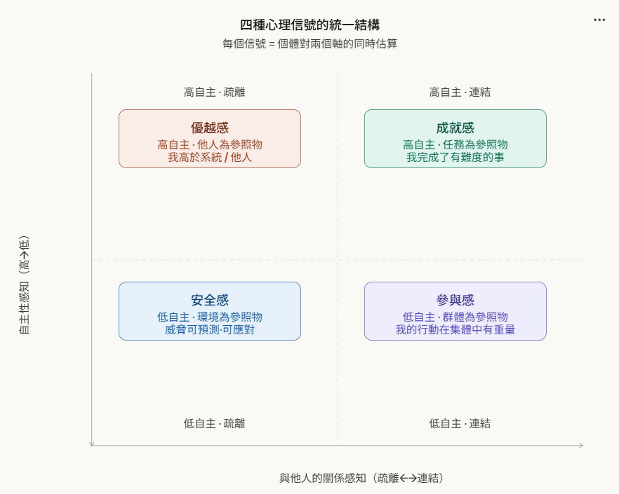
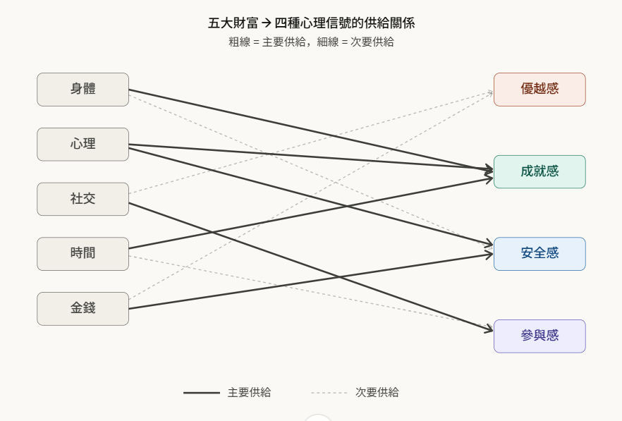
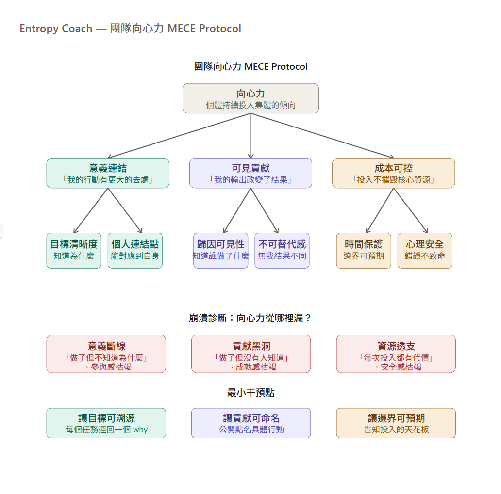

團隊向心力
Friday, March 20, 2026
9:52 PM

---先做抽象化工程，再導出向心力協議。

**第一步：把模糊詞抽象化**
這些詞（安全感、參與感、成就感、優越感）看起來是情緒，實際上是**個體對自身在系統中位置的即時估算信號**。
先建立統一語法。

**第二步：深化每個信號的結構**
四個信號有一個統一公式：
**心理信號 = f（參照物選擇 × 差距感知 × 時間歸因）**
| **信號** | **參照物** | **差距方向** | **時間歸因** | **崩潰條件** |
|----|----|----|----|----|
| **優越感** | 他人 / 地位體系 | 我 \> 他人 | 過去積累 | 參照物消失或比我強的出現 |
| **成就感** | 任務難度 / 自身舊標準 | 完成 \> 預期難度 | 當下完成 | 沒有難度感、無可見輸出 |
| **安全感** | 環境威脅 | 應對資源 \> 感知威脅 | 未來預測 | 不可預測事件、資源耗盡 |
| **參與感** | 群體目標 | 我的行動 ≠ 可取代 | 過程中 | 貢獻被忽略、感覺可替換 |
**關鍵洞察：這四個信號的脆弱性完全不同。**
- 優越感：最脆弱。參照物是外部的，他人行為不可控。
- 成就感：次穩定。依賴任務設計與輸出可見性。
- 安全感：可工程化。威脅可預測性是可操作的。
- 參與感：最被低估。它不需要「成功」，只需要「不可替代性的感知」。

**第三步：五大財富如何供給這四個信號關鍵結構性洞察：**
- 優越感幾乎沒有內部財富的直接供給，它主要依賴社交比較——這解釋了它的高脆弱性
- 成就感是身體、心理、時間三者的交集——任何一個耗盡都能讓它消失
- 參與感的主要供給只有社交財富，但它在工作情境中是向心力的核心燃料

**第四步：團隊向心力的MECE Protocol**
現在有足夠的底層結構了，可以嚴格推導向心力的組成。
**定義：** 向心力 ≠ 「大家都開心」。向心力 = **個體持續選擇將行動資源投入集體目標的傾向**。
它是一個動態均衡，不是靜態狀態。---

**Protocol 展開**
**向心力的三個必要條件（缺一崩潰）**
**一、意義連結**——供給參與感 個體必須能在自己的行動和集體目標之間畫出一條可追溯的線。這條線不需要宏大，但必須存在。
- 診斷問題：「如果這個團隊的目標消失，你的工作還有意義嗎？」如果答案是yes，意義連結已斷——他在做的是職能，不是貢獻。
**二、可見貢獻**——供給成就感與不可替代感 貢獻必須被系統承認，否則它對個體的心理財富沒有任何存儲效果。做了但沒有被看見 = 沒有做。
- 診斷問題：「上個月你做了什麼讓團隊結果不同的事？有人知道是你做的嗎？」兩個條件都要成立。
**三、成本可控**——供給安全感 個體對投入成本必須有邊界感。不知道會付出多少，等同於開放式風險，神經系統會保守性地拒絕投入。
- 診斷問題：「你知道這個項目會佔用你多少時間和精力嗎？」模糊的答案是成本失控的前兆。

**為什麼優越感不在向心力Protocol裡**
因為優越感是**零和信號**——我高於你的前提是你低於我。它可以在短期製造競爭驅動力，但結構上它消耗社交財富、破壞參與感的基礎。以優越感為向心力燃料的團隊，本質上在燃燒自身。
優越感在向心力框架裡的正確位置：作為個人成就的副產品，而不是集體凝聚的機制。

**三層角色的干預優先順序**
| **角色** | **最容易漏的條件** | **最小干預** |
|----|----|----|
| **員工** | 可見貢獻——做了但消失在流程中 | 每次完成任務後，主動用一句話告知直屬主管具體輸出 |
| **小主管** | 意義連結——自己都不確定why，無法傳遞 | 在分配任務前先說清楚這件事在全局哪裡，30秒夠 |
| **主管** | 成本可控——邊界從來沒有明確設定過 | 公開告知團隊「這個階段的合理投入上限」，即使只是估計值 |
向心力不是靠激勵建立的。它是靠**讓三個條件同時成立**來維持的。任何一個缺口，個體都會理性地減少投入。

*From \<<https://claude.ai/chat/5a4ce07f-e642-477f-8e1d-fcacd44fa124>\>*
