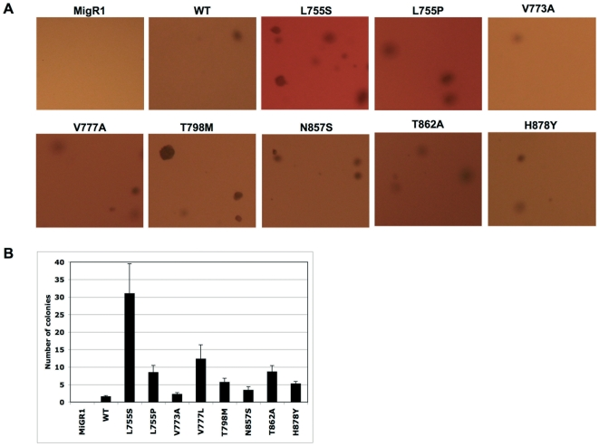

Paper deep dive
Saturday, February 7, 2026
8:49 AM

<https://journals.plos.org/plosone/article?id=10.1371/journal.pone.0190942>
<https://journals.plos.org/plosone/article?id=10.1371/journal.pone.0026760>
<https://aacrjournals.org/clincancerres/article/14/8/2465/34024/EXEL-7647-Inhibits-Mutant-Forms-of-ErbB2>
[https://www.dovepress.com/identification-of-an-activating-mutation-in-the-extracellular-domain-o-peer-reviewed-fulltext-article-OTT#](https://www.dovepress.com/identification-of-an-activating-mutation-in-the-extracellular-domain-o-peer-reviewed-fulltext-article-OTT)
<https://academic.oup.com/jnci/article-abstract/99/8/628/2522338?redirectedFrom=fulltext>
<https://pmc.ncbi.nlm.nih.gov/articles/PMC6678616/>
<https://erc.bioscientifica.com/view/journals/erc/13/1/0130221.xml>
<https://aacrjournals.org/mct/article/8/8/2152/93578/An-oncogenic-isoform-of-HER2-associated-with>
<https://aacrjournals.org/clincancerres/article/22/19/4859/249114/Dual-Characteristics-of-Novel-HER2-Kinase-Domain>
Furthermore, the efficacy of trastuzumab in d16HER2-overexpressing cancer models is controversial, given their resistance in vitro and sensitivity in vivo.
Although the binding of trastuzumab to d16HER2 might be impeded by d16HER2 homodimers with disulfide bridges, the concomitant high expression of wtHER2 on the tumor cell membrane facilitates the binding and therapeutic activity of this biodrug.
K753E and L755S were confirmed to be drug-resistant mutations (resistant to trastuzumab and lapatinib).

[Minerva-SSH](https://labs.icahn.mssm.edu/minervalab/ssh-connection-to-minerva-while-using-vpn/)
sup:
[InterPLM](https://www.nature.com/articles/s41592-025-02836-7): explainable characteristics be extracted from LM

\[C\]: clinical
Italics: second-handed info/ Paraphrased
Method: Search on PubMed
L755S: 34 results
- *It is believed that L755S mutation stabilizes the active conformation of HER2 while lapatinib could only target the inactive conformation of HER2  *
  Because the mutations are transforming, the L755S/P mutations either stabilize the active state relative to the inactive state or lower a barrier to activation. L755P may do this by reducing disorder of the inactive state and stabilizing the loop favorable for an active conformation. L755S likely destabilizes the interactions in the inactive state, observed to be hydrophobic. It is also possible that L755S introduces stabilizing polar interactions of a structurally altered active form. In conclusion, mutations affecting L755 seems to stabilize the active conformation of the ERBB2 kinase. This would explain the resistance to lapatinib that targets the inactive conformation of the ERBB2 kinase and the partly retained sensitivity to AEE778 that target preferentially the active conformation  
  Kancha, R. K., von Bubnoff, N., Bartosch, N., Peschel, C., Engh, R. A., & Duyster, J. (2011). Differential sensitivity of ERBB2 kinase domain mutations towards lapatinib. PloS one, 6(10), e26760. [https://doi.org/10.1371/journal.pone.0026760](https://doi.org/10.1371/journal.pone.0026760)
- K753E and L755S were confirmed to be drug-resistant mutations (resistant to trastuzumab and lapatinib). The mutation rate of HER2 was much higher than that in the primary tumor (2.24%, 28/1248).\[C\]  
  Clin Cancer Res (2016) 22 (19): 4859–4869.  
  [https://doi.org/10.1158/1078-0432.CCR-15-3036](https://doi.org/10.1158/1078-0432.CCR-15-3036)
- Although afatinib, neratinib, and osimertinib were shown to be effective against mot L755P and L755S mutations, the most common mutations in breast cancer.\[C\]  
  Clin Cancer Res (2018) 24 (20): 5112–5122.  
  [https://doi.org/10.1158/1078-0432.CCR-18-0991](https://doi.org/10.1158/1078-0432.CCR-18-0991)
- *Studies have shown that L755S mutation was able to enhance HER2 autophosphorylation as well as the downstream signaling pathway, such as MAPK and JNK/SAPK pathway  *
  [https://pmc.ncbi.nlm.nih.gov/articles/PMC3203921/](https://pmc.ncbi.nlm.nih.gov/articles/PMC3203921/)  
  [https://pmc.ncbi.nlm.nih.gov/articles/PMC4653184/](https://pmc.ncbi.nlm.nih.gov/articles/PMC4653184/)
- L755S, a HER2 kinase domain mutation, is the most common HER2 mutation in breast cancer associated with resistance to anti-HER2 trastuzumab treatment. Here, we showed that HER2-L755S confers hyperactivation of MAPK and PI3K/AKT/mTOR pathways and resistance to both reversible and irreversible HER2 tyrosine kinase inhibitors. We further demonstrated that the HER2 TKIs in combination with MEK inhibitor, AZD6244, or PI3K inhibitor, GDC0941, yield robust killing in HER2-L755S cancer cells, indicating a novel targeted strategy to overcome HER2-L755S resistance to anti-HER2 treatment.  
  Li, J., Xiao, Q., Bao, Y., Wang, W., Goh, J., Wang, P., & Yu, Q. (2019). HER2-L755S mutation induces hyperactive MAPK and PI3K-mTOR signaling, leading to resistance to HER2 tyrosine kinase inhibitor treatment. Cell cycle (Georgetown, Tex.), 18(13), 1513–1522. [https://doi.org/10.1080/15384101.2019.1624113](https://doi.org/10.1080/15384101.2019.1624113)
- L755S produced lapatinib resistance, but was not an activating mutation in our experimental systems.  
  Bose, R., Kavuri, S. M., Searleman, A. C., Shen, W., Shen, D., Koboldt, D. C., Monsey, J., Goel, N., Aronson, A. B., Li, S., Ma, C. X., Ding, L., Mardis, E. R., & Ellis, M. J. (2013). Activating HER2 mutations in HER2 gene amplification negative breast cancer. Cancer discovery, 3(2), 224–237. [https://doi.org/10.1158/2159-8290.CD-12-0349](https://doi.org/10.1158/2159-8290.CD-12-0349)
- Loganathan, T., & George Priya Doss, C. (2025). Computational molecular insights into ibrutinib as a potent inhibitor of HER2-L755S mutant in breast cancer: gene expression studies, virtual screening, docking, and molecular dynamics analysis. Frontiers in molecular biosciences, 12, 1510896. [https://doi.org/10.3389/fmolb.2025.1510896](https://doi.org/10.3389/fmolb.2025.1510896)
- CaseReport: For patients with HER2-amplified breast cancers harboring coexisting HER2 mutations, anti-HER2 antibody-drug conjugates such as T-DM1 and T-DXd may be more effective than conventional trastuzumab- or lapatinib-based therapies.  
  Mukohara, T., Hosono, A., Mimaki, S., Nakayama, A., Kusuhara, S., Funasaka, C., Nakao, T., Fukasawa, Y., Kondoh, C., Harano, K., Naito, Y., Matsubara, N., Tsuchihara, K., & Kuwata, T. (2021). Effects of Ado-Trastuzumab Emtansine and Fam-Trastuzumab Deruxtecan on Metastatic Breast Cancer Harboring HER2 Amplification and the L755S Mutation. The oncologist, 26(8), 635–639. [https://doi.org/10.1002/onco.13715](https://doi.org/10.1002/onco.13715)
- HER2 reactivation through acquisition of the HER2L755S mutation was identified as a mechanism of acquired resistance to lapatinib-containing HER2-targeted therapy in preclinical HER2-amplified breast cancer models, which can be overcome by irreversible HER1/2 inhibitors.  
  Xu, X., De Angelis, C., Burke, K. A., Nardone, A., Hu, H., Qin, L., Veeraraghavan, J., Sethunath, V., Heiser, L. M., Wang, N., Ng, C. K. Y., Chen, E. S., Renwick, A., Wang, T., Nanda, S., Shea, M., Mitchell, T., Rajendran, M., Waters, I., Zabransky, D. J., … Schiff, R. (2017). HER2 Reactivation through Acquisition of the HER2 L755S Mutation as a Mechanism of Acquired Resistance to HER2-targeted Therapy in HER2+ Breast Cancer. Clinical cancer research : an official journal of the American Association for Cancer Research, 23(17), 5123–5134. [https://doi.org/10.1158/1078-0432.CCR-16-2191](https://doi.org/10.1158/1078-0432.CCR-16-2191)
- Lapatinib showed stable but reverse orientation in binding site of K753E and the highest binding energy among studied HER2-lapatinib complexes but slightly lesser than L755S mutant. Results indicate that K753E has similar profile as L755S mutant for lapatinib.  
  Verma, S., Goyal, S., Kumari, A., Singh, A., Jamal, S., & Grover, A. (2018). Structural investigations on mechanism of lapatinib resistance caused by HER-2 mutants. PloS one, 13(2), e0190942. [https://doi.org/10.1371/journal.pone.0190942](https://doi.org/10.1371/journal.pone.0190942)
- Resistance to lapatinib has been reported in patients with L755S, V842I, and K753I.  
  Gaibar, M., Beltrán, L., Romero-Lorca, A., Fernández-Santander, A., & Novillo, A. (2020). Somatic Mutations in HER2 and Implications for Current Treatment Paradigms in HER2-Positive Breast Cancer. Journal of oncology, 2020, 6375956. [https://doi.org/10.1155/2020/6375956](https://doi.org/10.1155/2020/6375956)
- Cellline: Our in vivo studies revealed that L755S promotes E2-independent tumor growth and resistance to fulvestrant and neratinib. In contrast, S310F-expressing cells remain E2-dependent and sensitive to fulvestrant and neratinib treatment.  

  In fact, recent phase II Mut HER2 neratinib trial data support our conclusions that neratinib as a single agent was effective in patients with lobular histology, though lobular patients harboring recurrent L755 alterations were associated with less clinical efficacy (28).  

  HER2 mutations are significantly enriched in ER+ ILC compared with IDC, whereas HER2 amplification is more common in IDC, suggesting distinct HER2-driven oncogenic mechanisms and potential implications for targeted therapy selection.HER2-mutant–directed TKIs have particular value in ER+ ILC, where mutations drive oncogenesis more than amplification.  

  In line with our poziotinib antitumor activity data, we speculate by structural modeling that poziotinib binds to HER2 with closer proximity to S755 as compared with L755. Therefore, differential drug-binding proximity on HER2 mutants is a possible explanation for different allele-specific therapeutic responses. The rigid docking studies performed here do not consider conformational changes of HER2 L755S or distribution in the active conformation. To our understanding, the Molecular Dynamics (MD) simulations need to be performed further to gain a better understanding of poziotinib–L755S proximity.  
  Cancer Res (2022) 82 (16): 2928–2939. [https://doi.org/10.1158/0008-5472.CAN-21-3106](https://doi.org/10.1158/0008-5472.CAN-21-3106)
- CHMFL-26 *is a potent irreversible HER2 inhibitor that overcomes drug resistance caused by HER2 mutations and truncations, demonstrating promising preclinical efficacy in both HER2-amplified and mutant cancers.  *
  Cao, J. Y., Qi, S., Wu, H., Wang, A. L., Liu, Q. W., Li, X. X., Wang, B. L., Ge, J., Zou, F. M., Chen, C., Wang, J. J., Hu, C., Liu, J., Wang, W. C., & Liu, Q. S. (2022). CHMFL-26 is a highly potent irreversible HER2 inhibitor for use in the treatment of HER2-positive and HER2-mutant cancers. Acta pharmacologica Sinica, 43(10), 2678–2686. [https://doi.org/10.1038/s41401-022-00882-x](https://doi.org/10.1038/s41401-022-00882-x)
- Tras+Everolimus *cure HER2-mut  *
  Ma, J., Li, X., Zhang, Q., Li, N., Sun, S., Zhao, S., Zhao, Z., & Li, M. (2022). A novel treatment strategy of HER2-targeted therapy in combination with Everolimus for HR+/HER2- advanced breast cancer patients with HER2 mutations. Translational oncology, 21, 101444. [https://doi.org/10.1016/j.tranon.2022.101444](https://doi.org/10.1016/j.tranon.2022.101444)
- *Targetable genetic aberrations in the receptor tyrosine kinase/RAS/MAPK pathway are rare in triple-negative breast cancer, indicating limited opportunities for pathway-targeted therapies in this patient population.  *
  Grob, T. J., Heilenkötter, U., Geist, S., Paluchowski, P., Wilke, C., Jaenicke, F., Quaas, A., Wilczak, W., Choschzick, M., Sauter, G., & Lebeau, A. (2012). Rare oncogenic mutations of predictive markers for targeted therapy in triple-negative breast cancer. Breast cancer research and treatment, 134(2), 561–567. [https://doi.org/10.1007/s10549-012-2092-7](https://doi.org/10.1007/s10549-012-2092-7)
- The high frequency of ERBB2 mutations observed suggests that ERBB2 mutation testing should be considered in all invasive lobular carcinomas with nuclear grade 3.  
  Rosa-Rosa, J. M., Caniego-Casas, T., Leskela, S., Cristobal, E., González-Martínez, S., Moreno-Moreno, E., López-Miranda, E., Holgado, E., Pérez-Mies, B., Garrido, P., & Palacios, J. (2019). High Frequency of ERBB2 Activating Mutations in Invasive Lobular Breast Carcinoma with Pleomorphic Features. Cancers, 11(1), 74. [https://doi.org/10.3390/cancers11010074](https://doi.org/10.3390/cancers11010074)
- target-based mechanisms of resistance to lapatinib and suggest that EXEL-7647 may be able to circumvent these effects.  
  Trowe, T., Boukouvala, S., Calkins, K., Cutler, R. E., Jr, Fong, R., Funke, R., Gendreau, S. B., Kim, Y. D., Miller, N., Woolfrey, J. R., Vysotskaia, V., Yang, J. P., Gerritsen, M. E., Matthews, D. J., Lamb, P., & Heuer, T. S. (2008). EXEL-7647 inhibits mutant forms of ErbB2 associated with lapatinib resistance and neoplastic transformation. Clinical cancer research : an official journal of the American Association for Cancer Research, 14(8), 2465–2475. [https://doi.org/10.1158/1078-0432.CCR-07-4367](https://doi.org/10.1158/1078-0432.CCR-07-4367)
d16her2: 10 results (K753E included)
- «span style='color:#1A1A1A'»*originally detected in several HER2-overexpressing breast cancer cell lines  *
  Kwong KY, Hung M-C. A novel splice variant of HER2 with increased transformation activity. Mol Carcinog 1998;23:62–8.  
  Siegel PM, Ryan ED, Cardiff RD, Muller WJ. Elevated expression of activated forms of Neu/ErbB-2 and ErbB-3 are involved in the induction of mammary tumors in transgenic mice: implications for human breast cancer. EMBO J 1999;18:2149–64.«/span»
- *del.16 (exon 16 deletion in the extracellular domain of HER2), has been linked to the resistance of trastuzumab through the activation of the downstream SRC kinase signaling  *
  Transgenic Δ16HER2 expressed on the tumor cell plasma membrane from spontaneous mammary adenocarcinomas formed constitutively active homodimers able to activate the oncogenic signal transduction pathway mediated through Src kinase.  
  Marchini, C., Gabrielli, F., Iezzi, M., Zenobi, S., Montani, M., Pietrella, L., Kalogris, C., Rossini, A., Ciravolo, V., Castagnoli, L., Tagliabue, E., Pupa, S. M., Musiani, P., Monaci, P., Menard, S., & Amici, A. (2011). The human splice variant Δ16HER2 induces rapid tumor onset in a reporter transgenic mouse. PloS one, 6(4), e18727. [https://doi.org/10.1371/journal.pone.0018727](https://doi.org/10.1371/journal.pone.0018727)
- **tumor cell lines expressing HER2Δ16 are resistant to the HER2-targeted therapy trastuzumab.  
    **
  Trastuzumab, a Food and Drug Administration–approved humanized monoclonal antibody directed against the HER2 cell surface receptor, has emerged as an important intervention for patients with HER2-positive tumors. However, the vast majority of patients exhibit de novo resistance to single-agent trastuzumab with an objective response observed in only 12% to 24% of patients with HER2-positive tumors and all initial responders develop resistance in \<6 months (1–3). Improved patient responses of 40% to 50% are observed when trastuzumab is used in combination with chemotherapy; however, similar to single-agent trastuzumab, many of these patients eventually acquire trastuzumab resistance (10, 11). Early indications from clinical trials of trastuzumab and chemotherapy combinations in the adjuvant setting appear promising with impressive patient response rates, but acquired resistance to trastuzumab remains a serious problem (12, 13).  

  Molecular events that contribute to trastuzumab resistance have been proposed including inactivation of the PTEN phosphatase resulting in enhanced AKT signaling (14) and suppression of p27Kip1, thus disengaging trastuzumab-induced G1 cell cycle arrest (15). In addition, a unique insulin-like growth factor receptor-1 and HER2 heterodimer has been detected in trastuzumab-resistant cell lines and disrupting insulin-like growth factor receptor-1/HER2 crosstalk sensitizes resistant cells to trastuzumab (16). Although promising, clinical verification of these molecular findings will be necessary. For example, one recent study failed to detect an association between expression of PTEN or the PTEN target AKT and clinical outcome of breast cancer patients receiving neoadjuvant trastuzumab (17).  

  *Tumor-specific genetic or molecular alterations that increase HER2’s oncogenic activity or interfere with trastuzumab binding can contribute to trastuzumab resistance. Although studies have not identified strong activating HER2 somatic mutations in HER2-amplified breast cancers, different HER2 isoforms have been detected in tumors and may still influence trastuzumab responsiveness.  *
  Mol Cancer Ther (2009) 8 (8): 2152–2162. [https://doi.org/10.1158/1535-7163.MCT-09-0295](https://doi.org/10.1158/1535-7163.MCT-09-0295)
- *The d16HER2 splice variant enhances breast cancer aggressiveness by promoting stemness features, EMT, and Notch pathway activity, supporting its role in tumor initiation, progression, and potentially modulating response to targeted HER2 therapies.  *
  Castagnoli, L., Iorio, E., Dugo, M., Koschorke, A., Faraci, S., Canese, R., Casalini, P., Nanni, P., Vernieri, C., Di Nicola, M., Morelli, D., Tagliabue, E., & Pupa, S. M. (2019). Intratumor lactate levels reflect HER2 addiction status in HER2-positive breast cancer. Journal of cellular physiology, 234(2), 1768–1779. [https://doi.org/10.1002/jcp.27049](https://doi.org/10.1002/jcp.27049)
- Here, we provide genetic evidence in transgenic mice that expression of d16HER2 is sufficient to accelerate mammary tumorigenesis and improve the response to trastuzumab. A comparative analysis of effector signaling pathways activated by d16HER2 and wild-type HER2 revealed that d16HER2 was optimally functional through a link to SRC activation (pSRC). Clinically, HER2-positive breast cancers from patients who received trastuzumab exhibited a positive correlation in d16HER2 and pSRC abundance, consistent with the mouse genetic results. Moreover, patients expressing high pSRC or an activated “d16HER2 metagene” were found to derive the greatest benefit from trastuzumab treatment.  
  characterized by an imbalance in the number of cysteines in the ECD portion and by the constitutive generation of stable HER2 homodimers, is a highly penetrant HER2 oncogenic alteration.  
  (In medical genetics, the penetrance of a disease-causing mutation is the proportion of individuals with the mutation that exhibit clinical symptoms among all individuals with such mutation.)  
  In light of our previous speculation that the proportion and relevance of d16HER2 in HER2-positive breast cancers might redefine its role in sensitivity/resistance to trastuzumab and can have an impact on current therapeutic strategies (32), we sought clinical verification of our preclinical data by examining tissue from 84 HER2-positive breast cancers treated with adjuvant trastuzumab (41). In 43 out of 84 breast cancer specimens for which frozen samples were available for d16HER2 qRT-PCR analysis, 12 out of 13 high-pSRC–expressing primary tumors expressed elevated levels of d16HER2 transcript, strongly suggesting that pSRC reflects activated d16HER2 homodimers in human HER2-positive breast cancers. Indeed, such tumors are enriched in “tumor metastasis,” “hypoxia,” and “cell motility” pathways, all features of aggressiveness revealed in the d16HER2 tg model. Thus, the better prognosis observed in the trastuzumab-treated HER2-positive breast cancer patients with elevated pSRC could be a direct consequence of the expression on their tumors of an activated d16HER2–SRC signaling axis, as observed in the trastuzumab-sensitive d16HER2-driven mouse model.  
  *Thus, high activated-d16HER2 metagene expression specifically predicts enhanced responsiveness to trastuzumab-based therapy rather than to chemotherapy alone.  *
  Cancer Res (2014) 74 (21): 6248–6259. [https://doi.org/10.1158/0008-5472.CAN-14-0983](https://doi.org/10.1158/0008-5472.CAN-14-0983)  
  Activated HER2 signaling, rather than d16HER2 expression alone, reflects pSRC-dependent driver activity and predicts trastuzumab responsiveness, highlighting the need to consider tumor stage and HER2 pathway activity in treatment decisions.  
  [https://aacrjournals.org/cancerres/article/74/21/6248/599323/Activated-d16HER2-Homodimers-and-SRC-Kinase#:~:text=Our%20findings%20seem,appropriate%20pharmacologic%20strategies](https://aacrjournals.org/cancerres/article/74/21/6248/599323/Activated-d16HER2-Homodimers-and-SRC-Kinase#:~:text=Our%20findings%20seem,appropriate%20pharmacologic%20strategies).
- RNA in situ hybridization: Our results demonstrate the existence of outliers, with d16HER2 mRNA high scores restricted to HER2-positive gastric cancer (GC) and colorectal cancer (CRC) coupled with increased d16HER2 expression compared with BC. Consistent with previously reported data on BC, experiments performed in HER2-positive GC patient-derived xenografts suggest that increased d16HER2 expression is associated with a clinical benefit/response to single-agent trastuzumab. Therefore, d16HER2 may be considered as a “flag” of HER2 dependence in GC and can be clinically investigated as a marker of trastuzumab susceptibility in several other HER2-driven cancers, including CRC. As a clinical proof-of-concept, we indicate that high d16HER2 mRNA scores are exclusively found in patients with a long-term benefit from trastuzumab exceeding 12 months (clinical “outliers”), and that d16HER2 expression is also increased in circulating tumor-released exosomes obtained from baseline plasma samples of long-term responders.  
  Volpi, C. C., Pietrantonio, F., Gloghini, A., Fucà, G., Giordano, S., Corso, S., Pruneri, G., Antista, M., Cremolini, C., Fasano, E., Saggio, S., Faraci, S., Di Bartolomeo, M., de Braud, F., Di Nicola, M., Tagliabue, E., Pupa, S. M., & Castagnoli, L. (2019). The landscape of d16HER2 splice variant expression across HER2-positive cancers. Scientific reports, 9(1), 3545. [https://doi.org/10.1038/s41598-019-40310-5](https://doi.org/10.1038/s41598-019-40310-5)
- We also found that PEITC(Phenethyl isothiocyanate) hampered the in vivo growth of MI6 nodules by inducing hemorrhagic and necrotic intra-tumor areas and, in combination with trastuzumab, by significantly reducing spontaneous tumor development in d16HER2 transgenic mice.  
  Koschorke, A., Faraci, S., Giani, D., Chiodoni, C., Iorio, E., Canese, R., Colombo, M. P., Lamolinara, A., Iezzi, M., Ladomery, M., Vernieri, C., de Braud, F., Di Nicola, M., Tagliabue, E., Castagnoli, L., & Pupa, S. M. (2019). Phenethyl isothiocyanate hampers growth and progression of HER2-positive breast and ovarian carcinoma by targeting their stem cell compartment. Cellular oncology (Dordrecht, Netherlands), 42(6), 815–828. [https://doi.org/10.1007/s13402-019-00464-w](https://doi.org/10.1007/s13402-019-00464-w)
- A d16HER2 splice variant is a flag of HER2 addiction across HER2-positive cancer  
  Volpari, T., De Santis, F., Bracken, A. P., Pupa, S. M., Buschbeck, M., Wegner, A., Di Cosimo, S., Lisanti, M. P., Dotti, G., Massaia, M., Pruneri, G., Anichini, A., Fortunato, O., De Braud, F., Del Vecchio, M., & Di Nicola, M. (2020). Anticancer innovative therapy: Highlights from the ninth annual meeting. Cytokine & growth factor reviews, 51, 1–9. [https://doi.org/10.1016/j.cytogfr.2019.12.002](https://doi.org/10.1016/j.cytogfr.2019.12.002)
- We demonstrate that within weeks of expression, morphologic aberrations were already present and unique to each HER2 isoform. Although WTHER2 cells were abundant throughout the mammary ducts, detectable lesions were exceptionally rare. In contrast, d16HER2 and p95HER2 induced rapid tumor development. d16HER2 incited homogenous and proliferative luminal-like lesions which infrequently progressed to invasive phenotypes whereas p95HER2 lesions were heterogenous and invasive at the smallest detectable stage. Distinct cancer trajectories were observed for d16HER2 and p95HER2 tumors as evidenced by oncogene-dependent changes in epithelial specification and the tumor microenvironment. These data provide direct experimental evidence that intratumor heterogeneity programs begin very early and well in advance of screen or clinically detectable breast cancer.  
  Ginzel, J. D., Acharya, C. R., Lubkov, V., Mori, H., Boone, P. G., Rochelle, L. K., Roberts, W. L., Everitt, J. I., Hartman, Z. C., Crosby, E. J., Barak, L. S., Caron, M. G., Chen, J. Q., Hubbard, N. E., Cardiff, R. D., Borowsky, A. D., Lyerly, H. K., & Snyder, J. C. (2021). HER2 Isoforms Uniquely Program Intratumor Heterogeneity and Predetermine Breast Cancer Trajectories During the Occult Tumorigenic Phase. Molecular cancer research : MCR, 19(10), 1699–1711. [https://doi.org/10.1158/1541-7786.MCR-21-0215](https://doi.org/10.1158/1541-7786.MCR-21-0215)
S310F binding: 4 results
- We found through bioinformatics analysis that S310F, an activating mutation in the HER2 extracellular domain, was the most frequent mutation in HER2. The S310F mutation was shown to confer resistance of HER2-positive tumour cells to pertuzumab treatment. With molecular modelling analysis, we confirmed the possibility that the S310F mutation might disrupt the interaction between pertuzumab and HER2 as a result of a significant change in the critical residue S310. Further functional analyses revealed that the S310F mutation completely abolished pertuzumab binding to HER2 receptor and inhibited pertuzumab antitumour efficacy.  
  Zhang, Y., Wu, S., Zhuang, X., Weng, G., Fan, J., Yang, X., Xu, Y., Pan, L., Hou, T., Zhou, Z., & Chen, S. (2019). Identification of an Activating Mutation in the Extracellular Domain of HER2 Conferring Resistance to Pertuzumab. OncoTargets and therapy, 12, 11597–11608. [https://doi.org/10.2147/OTT.S232912](https://doi.org/10.2147/OTT.S232912)
- *The study reveals the structural mechanism of the HER2–HER3 heterodimer. HER2 does not undergo ligand-induced conformational changes, causing the HER3 dimerization arm to remain unresolved in the wild-type heterodimer. The oncogenic HER2 S310F mutation forms a compensatory interaction that stabilizes the HER2–HER3 interface, explaining its strong oncogenic activity and pertuzumab resistance. Both wild-type and mutant heterodimers can bind trastuzumab, but only the wild-type binds pertuzumab. The structures show that both oncogenic mutations and therapeutic antibodies exploit the intrinsic conformational dynamics of the HER2–HER3 dimer. The findings also explain why the HER2 extracellular domain does not homodimerize through a canonical active interface.  *
  Diwanji, D., Trenker, R., Thaker, T. M., Wang, F., Agard, D. A., Verba, K. A., & Jura, N. (2021). Structures of the HER2-HER3-NRG1β complex reveal a dynamic dimer interface. Nature, 600(7888), 339–343. [https://doi.org/10.1038/s41586-021-04084-z](https://doi.org/10.1038/s41586-021-04084-z)
- This study identified new oncogenic HER2 allosteric mutations, particularly in the extracellular domain (ECD), transmembrane domain, and kinase domain, with covalent homodimerization as a common mechanism of activation. These allosteric HER2 mutants, including the prevalent S310F mutation, show reduced sensitivity to existing HER2-targeted therapies such as trastuzumab and lapatinib, highlighting the need for novel inhibitors to effectively treat HER2-mutant cancers.  
  Ishiyama, N., O'Connor, M., Salomatov, A., Romashko, D., Thakur, S., Mentes, A., Hopkins, J. F., Frampton, G. M., Albacker, L. A., Kohlmann, A., Roberts, C., & Buck, E. (2023). Computational and Functional Analyses of HER2 Mutations Reveal Allosteric Activation Mechanisms and Altered Pharmacologic Effects. Cancer research, 83(9), 1531–1542. [https://doi.org/10.1158/0008-5472.CAN-21-0940](https://doi.org/10.1158/0008-5472.CAN-21-0940)
- we have successfully employed computational-aided rational design to undertake directed evolution of pertuzumab, resulting in the creation of an evolved pertuzumab variant named Ptz-SA. This variant, with only two mutations (T30S/D31A) located on its heavy chain, effectively reinstates binding to the mutated antigen, at the expense of a 35-fold reduction in binding affinity to HER2 (S310F) compared to the wild-type pair.  
  Bai, X., Xu, L., Wang, Z., Zhuang, X., Ning, J., Sun, Y., Wang, H., Guo, Y., Xu, Y., Guo, J., Chen, S., & Pan, L. (2025). Computational-aided rational mutation design of pertuzumab to overcome active HER2 mutation S310F through antibody-drug conjugates. Proceedings of the National Academy of Sciences of the United States of America, 122(1), e2413686122. [https://doi.org/10.1073/pnas.2413686122](https://doi.org/10.1073/pnas.2413686122)
p95her2 resistance mechanism
- Resistance emerges from p95HER2 (in 30% of cases), a truncated HER2 evading trastuzumab but sensitive to TKIs like lapatinib, HER2 mutations (L755S, T798M in 2–5%), compensatory pathways (EGFR, HER3, IGF-1R, MET), PIK3CA mutations/PTEN loss (20–30%), TME-driven immune evasion (PD-L1/HLA-G in 20%), and hypoxia/TGF-β, all sustaining PI3K/AKT or MAPK signalling and reducing trastuzumab/endocrine therapy efficacy  
  Laskar, T. T., Laskar, H. M., Mazumder, J. A., Bhattacharjee, R., Husain, M. I., Das, B., Das, P., Choudhury, P. D., Arora, M., Borah, S., Chakraborty, D., Chakraborty, P., & Das, A. (2025). Decoding breast cancer: insights into molecular pathways & therapeutic approaches. Discover oncology, 16(1), 2103. [https://doi.org/10.1007/s12672-025-03764-w](https://doi.org/10.1007/s12672-025-03764-w)
- neratinib potently directs proteasomal degradation of p95HER2, relieving its immunosuppressive effects, and provide proof of concept that neratinib and/or agents targeting p95HER2 downstream mediators can restore antitumor immunity and trastuzumab deruxtecan efficacy.  
  Hu, D., Lyu, X., Li, Z., Ekambaram, P., Dongre, A., Freeman, T., Joy, M., Atkinson, J. M., Brown, D. D., Cai, Z., Carleton, N. M., Crentsil, H. E., Little, J., 4th, Kemp, F., Klei, L. R., Beecher, M., Sperinde, J., Huang, W., Joensuu, H., Srinivasan, A., … Lucas, P. C. (2025). p95HER2, a truncated form of the HER2 oncoprotein, drives an immunosuppressive program in HER2+ breast cancer that limits trastuzumab deruxtecan efficacy. Nature cancer, 6(7), 1202–1222. [https://doi.org/10.1038/s43018-025-00969-4](https://doi.org/10.1038/s43018-025-00969-4)
- Alternative pathway: HER2 signals through a non-canonical regulated intramembrane proteolysis (RIP) pathway, where sequential cleavage by ADAM10 and γ-secretase produces nuclear p75HER2 that promotes cell proliferation. Trastuzumab targets this pathway by inhibiting these proteolytic events. Aberrant activation of the RIP pathway confers resistance to trastuzumab, which can be overcome by combining trastuzumab with ADAM10 and γ-secretase inhibitors to fully block p75HER2 production.  
  Nami, B., & Wang, Z. (2024). A Non-Canonical p75HER2 Signaling Pathway Underlying Trastuzumab Action and Resistance in Breast Cancer. Cells, 13(17), 1452. [https://doi.org/10.3390/cells13171452](https://doi.org/10.3390/cells13171452)
- Pathway: Yang, M., Li, Y., Kong, L., Huang, S., He, L., Liu, P., Mo, S., Lu, X., Lin, X., Xiao, Y., Shi, D., Huang, X., Chen, B., Chen, X., Ouyang, Y., Li, J., Lin, C., & Song, L. (2023). Inhibition of DPAGT1 suppresses HER2 shedding and trastuzumab resistance in human breast cancer. The Journal of clinical investigation, 133(14), e164428. [https://doi.org/10.1172/JCI164428](https://doi.org/10.1172/JCI164428)
- *p95HER2 expression correlates with trastuzumab resistance in HER2-positive breast cancer, but it is not an independent predictor. The data suggest that p95HER2 is sensitive but not specific for predicting trastuzumab resistance.  *
  Ozkavruk Eliyatkin, N., Aktas, S., Ozgur, H., Ercetin, P., & Kupelioglu, A. (2016). The role of p95HER2 in trastuzumab resistance in breast cancer. Journal of B.U.ON. : official journal of the Balkan Union of Oncology, 21(2), 382–389.
- The ECDs of HER2 receptors are organized into four regions that include two leucine-rich domains (I/L1, III/L2), which are responsible for ligand binding, and two cysteine-rich domains (II/CR1, IV/CR2) with disulfide bond connections, which are responsible for receptor dimerization. In the absence of ligand, HER1, HER3 and HER4 adopt a tethered conformation in which domains II and IV are not available for dimerization. Conversely, due to a strong interaction between the two leucine-rich domains, HER2 always adopts a conformation similar to ligand-bound receptors in which the dimerization arms remain constitutively extended and free to homo- or heterodimerize  

  Tural, D., Akar, E., Mutlu, H., & Kilickap, S. (2014). P95 HER2 fragments and breast cancer outcome. Expert Review of Anticancer Therapy, 14(9), 1089–1096. [https://doi.org/10.1586/14737140.2014.929946](https://doi.org/10.1586/14737140.2014.929946)
- 
Appendix
<https://doi.org/10.1371/journal.pone.0026760>

[https://pubmed.ncbi.nlm.nih.gov/27697991/](https://pubmed.ncbi.nlm.nih.gov/27697991/)
Table 1.Inhibition of cell growth by lapatinib and neratinib
<table style="width:100%;">
<colgroup>
<col style="width: 22%" />
<col style="width: 21%" />
<col style="width: 30%" />
<col style="width: 25%" />
</colgroup>
<thead>
<tr>
<th></th>
<th></th>
<th>

IC50 (nmol/L)a
</th>
<th></th>
</tr>
</thead>
<tbody>
<tr>
<td>Cell</td>
<td></td>
<td>Lapatinib</td>
<td>Neratinib</td>
</tr>
<tr>
<td>MCF10A</td>
<td>HER2 WT</td>
<td>480 ± 50</td>
<td>&lt;2</td>
</tr>
<tr>
<td></td>
<td>K753E</td>
<td>&gt;10,000</td>
<td>32 ± 8</td>
</tr>
<tr>
<td></td>
<td>L768S</td>
<td>1,050 ± 480</td>
<td>&lt;2</td>
</tr>
<tr>
<td></td>
<td>V773L</td>
<td>960 ± 380</td>
<td>&lt;2</td>
</tr>
<tr>
<td></td>
<td>R647K</td>
<td>650 ± 370</td>
<td>&lt;2</td>
</tr>
<tr>
<td></td>
<td>I655V</td>
<td>520 ± 420</td>
<td>&lt;2</td>
</tr>
<tr>
<td></td>
<td>K676R</td>
<td>385 ± 270</td>
<td>&lt;2</td>
</tr>
<tr>
<td></td>
<td>Q680R</td>
<td>550 ± 190</td>
<td>&lt;2</td>
</tr>
<tr>
<td>BT474</td>
<td></td>
<td>72 ± 24</td>
<td>&lt;2</td>
</tr>
<tr>
<td></td>
<td>HER2 WT</td>
<td>109 ± 36</td>
<td>&lt;2</td>
</tr>
<tr>
<td></td>
<td>K753E</td>
<td>1,240 ± 460</td>
<td>40 ± 8</td>
</tr>
<tr>
<td></td>
<td>L768S</td>
<td>286 ± 110</td>
<td>&lt;2</td>
</tr>
<tr>
<td></td>
<td>V773L</td>
<td>218 ± 85</td>
<td>&lt;2</td>
</tr>
<tr>
<td></td>
<td>R647K</td>
<td>86 ± 40</td>
<td>&lt;2</td>
</tr>
<tr>
<td></td>
<td>I655V</td>
<td>120 ± 52</td>
<td>&lt;2</td>
</tr>
<tr>
<td></td>
<td>K676R</td>
<td>64 ± 36</td>
<td>&lt;2</td>
</tr>
<tr>
<td></td>
<td>Q680R</td>
<td>78 ± 5</td>
<td>&lt;2</td>
</tr>
<tr>
<td>MDA-MB-231</td>
<td>HER2 WT</td>
<td>3,620 ± 860</td>
<td>410 ± 140</td>
</tr>
<tr>
<td></td>
<td>K753E</td>
<td>&gt;10,000</td>
<td>889 ± 215</td>
</tr>
<tr>
<td></td>
<td>L768S</td>
<td>4,890 ±1110</td>
<td>590 ± 165</td>
</tr>
<tr>
<td></td>
<td>V773L</td>
<td>4,980 ± 785</td>
<td>780 ± 184</td>
</tr>
<tr>
<td></td>
<td>R647K</td>
<td>3,578 ± 759</td>
<td>472 ± 106</td>
</tr>
<tr>
<td></td>
<td>I655V</td>
<td>3,496 ± 808</td>
<td>508 ± 108</td>
</tr>
<tr>
<td></td>
<td>K676R</td>
<td>3,730 ± 960</td>
<td>537 ± 124</td>
</tr>
<tr>
<td></td>
<td>Q680R</td>
<td>3,778 ± 845</td>
<td>496 ± 98</td>
</tr>
<tr>
<td>MCF7</td>
<td></td>
<td>&gt;10,000</td>
<td>&gt;3,000</td>
</tr>
</tbody>
</table>
NOTE: Cells were incubated with certain drugs for six days, and cell viability was measured using CCK8 assay.
aMean IC50 (nmol/L) ± SD from three independent determinations.

