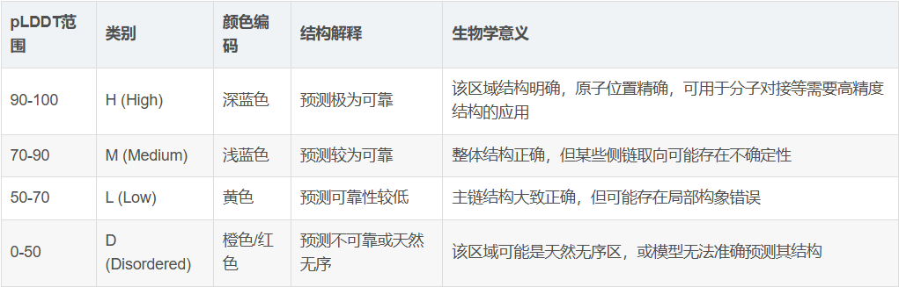

AM

- **Interface predicted template modelling (ipTM)**: a measure of the **accuracy** of the predicted structure of a multimer
- **Predicted aligned error (PAE):** It is effectively a measure of **how confident** AlphaFold is that the protein’s domains are well packed and that the **relative placement of the domains/residues** in the predicted structure is correct.
- **Predicted template modelling score (pTM):** an integrated measure of how well AlphaFold-Multimer has predicted the structure of a complex. It is the predicted template modelling (TM) score for a superposition between the predicted structure and the hypothetical true structure. pTM scores vary between 0 and 1: a score above 0.5 means the overall predicted fold for the complex will be similar to the true structure.
- 
- GPT insight
  - ipTM reflects confidence in relative chain placement and is largely insensitive to mutation-induced loss of binding chemistry when global interface geometry is preserved. Drug resistance mutations are therefore expected to affect **interface-local confidence and contact features**, rather than ipTM itself.
**What *should* change in resistant mutants (model-side)**
If your benchmark is meaningful, resistant mutations should show:
**Strong signals**
- ↓ **Interface pLDDT**
- ↑ **Inter-chain PAE (localized to epitope)**
- ↓ **Number / quality of contacts**
- ↓ **BSA at the paratope–epitope**
**Optional but powerful**
- ↑ **Pose variance across seeds**
- ↑ **ΔΔG (FoldX / Rosetta)**
**Weak or unreliable**
- ipTM
- ranking_confidence
**3. Recommended column groups (drop-in replacements)**
**A. Keep iPTM — but demote it**
Do **not remove** iPTM, but **relabel and reframe** it.
**Instead of**
- WT_mean_iPTM
- Mutant_mean_iPTM
- Delta_iPTM
**Use**
- Interchain_Assembly_Confidence_WT
- Interchain_Assembly_Confidence_Mut
- ΔInterchain_Assembly_Confidence
This makes it clear that:
iPTM = assembly confidence, not binding strength

**B. Add interface-local confidence (this is the missing core)**
These should become your **primary columns**.
**New columns to add:**
- Mean_Interface_pLDDT_WT
- Mean_Interface_pLDDT_Mut
- ΔInterface_pLDDT
- Interface_pLDDT_Collapse\_%
Why:
- Resistant mutations **should reduce local certainty**
- This captures chemical/interface degradation
If you only add **one new metric**, make it this.

**C. Add inter-chain PAE statistics (geometry uncertainty)**
Replace abstract “confidence” with **explicit spatial uncertainty**.
**Columns:**
- Mean_Interchain_PAE_WT
- Mean_Interchain_PAE_Mut
- ΔInterchain_PAE
- PAE_Interface_Area\_\<5Å
Interpretation:
- ↑ PAE = model unsure how chains relate
- Very sensitive to epitope disruption

**D. Replace SD with robustness-aware metrics**
Right now you have SDs over predictions. SD alone is weak.
**Instead of**
- WT_sd
- Mutant_sd
**Use**
- Pose_Clustering_Count
- Largest_Cluster_Fraction
- Across_Seed_RMSD_Interface
Why:
- Resistance often → **pose instability**, not just score shift
- AF3 and Boltz2 differ strongly here

**E. Add geometry / contact degradation (model-agnostic)**
These anchor the benchmark in **physical reality**.
**Columns:**
- Buried_Surface_Area_WT
- Buried_Surface_Area_Mut
- ΔBSA
- Interface_Contact_Count
- Lost_Contacts_vs_WT
This prevents “pretty but empty” interfaces from scoring well.
**Per WT / mutant:**
1.  **iPTM  **
    → Inter-chain assembly confidence (sanity check)
2.  **Mean interface pLDDT  **
    → Local interface integrity
3.  **Mean inter-chain PAE (interface-restricted)  **
    → Local relative placement uncertainty
4.  **Δ(interface pLDDT)** and **Δ(interface PAE)** vs WT  
    → Mutation effect signal
- 

